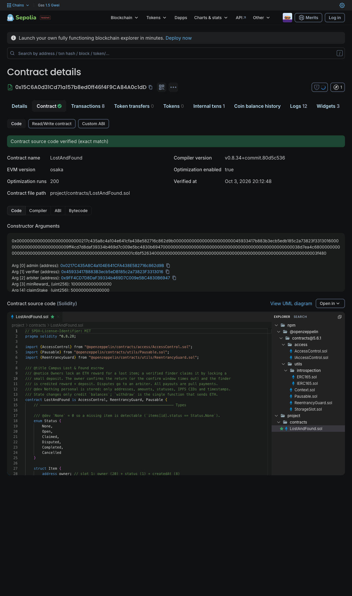
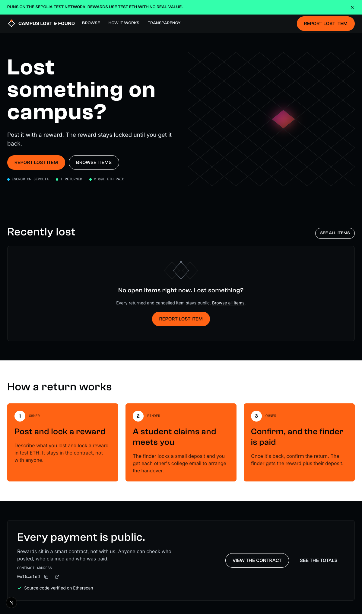
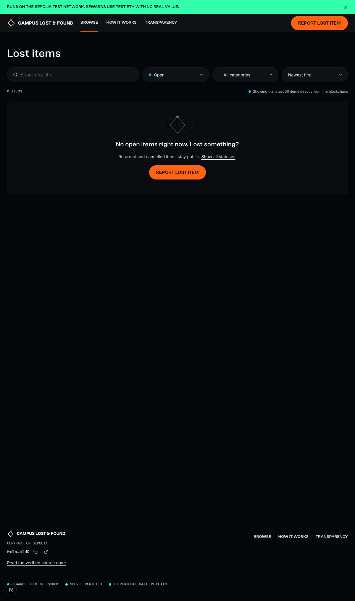
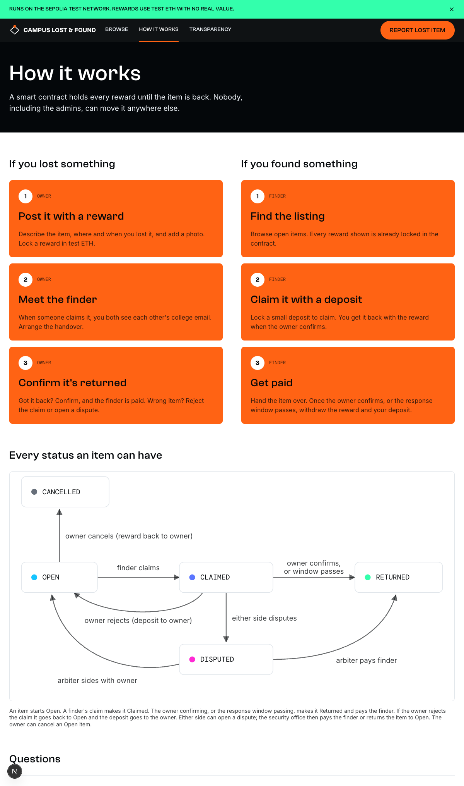
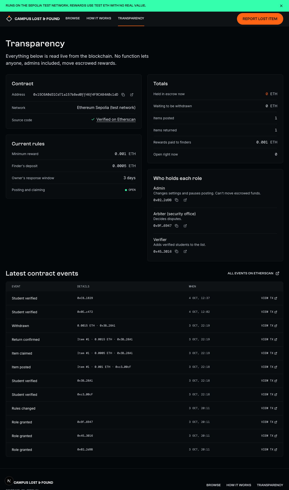

# Campus Lost & Found

A campus lost-and-found where a smart contract holds each reward in escrow. A student who lost something
posts it and locks a reward in test ETH; a finder claims it by locking a small deposit; once the owner
confirms the return (or the response window passes) the finder withdraws the reward plus their deposit.
Disputes go to a campus-security arbiter, and no role, admins included, can move escrowed funds.
It runs on the Ethereum Sepolia testnet, so all money is free test ETH.

**Deployed contract:** [`0x15C6A0d31Cd71a157b8ed0ff46f4F9CA84A0c1dD` on Sepolia Etherscan](https://sepolia.etherscan.io/address/0x15C6A0d31Cd71a157b8ed0ff46f4F9CA84A0c1dD#code)
(source verified on Etherscan, Blockscout and Sourcify).

## Tech stack

- **Contracts:** Solidity 0.8, OpenZeppelin v5, Hardhat 3 (viem, `node:test`), Hardhat Ignition, Slither
- **Web:** Next.js 16 App Router, React, TypeScript, Tailwind CSS v4, shadcn/ui
- **Chain access:** wagmi + viem + TanStack Query, MetaMask
- **Indexing:** The Graph subgraph, with direct-contract fallback
- **Tooling:** pnpm workspaces, Vitest, Playwright

## Screenshots

### Verified contract

The deployed `LostAndFound` contract on Sepolia with its source code verified (exact match). Anyone can
read the escrow logic and constructor settings and check them against this repo without trusting us.

### Home

The landing page explains the three-step return flow and shows live stats from the contract (items
returned, ETH paid out). The "Every payment is public" panel links straight to the verified contract.

### Browse items

The items board with search, status, category and sort filters, read directly from the blockchain.
It is empty here because there are no open items at the moment; this is the empty state.

### How it works

Step-by-step guides for owners and finders, plus a diagram of every status an item can move through:
open, claimed, disputed, returned and cancelled, and what triggers each change.

### Transparency

A public audit page read live from the chain: current rules (minimum reward, finder's deposit, response
window), escrow totals, which wallet holds each role, and the latest contract events with links to every
transaction.

These are the logged-out public pages. Sign-in and the posting/claiming flows are still in progress.

## More

- [PLAN.md](PLAN.md): build plan and progress by phase
- [docs/RUNBOOK.md](docs/RUNBOOK.md): deployments, wallets and operating steps
- [docs/UI_SPEC.md](docs/UI_SPEC.md): page designs and flows
- [docs/DECISIONS.md](docs/DECISIONS.md): decisions and deviations log
